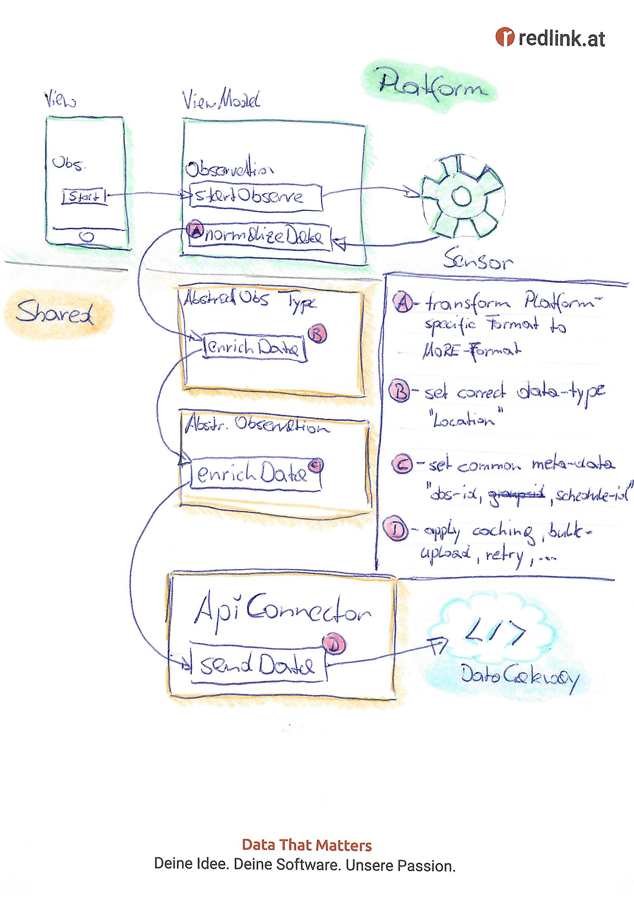

# Base Architecture

We want to keep as much of the business-logic as possible in the `shared` module to leverage
synergies between the platforms.

All interactions/operations start from the platform-specific layers (Android, iOS) - build up the
required context and move the control-flow to the shared services. Platform-specific code should
emphasise on

* low-level access to sensors and services (e.g. notification, task-scheduling),
* transforming platform-specific datastructure into the common data-models
* User Interfaces and Interaction

## Observation Flow / Recording Data

1. Recording Data (starting an observation) is initiated in the (platform-specific) View/ViewModel.
   The Sensor is launched via e.g. a System-Call; registering a callback-handler to process the data
   (still platform-specific: `startObserve`).

2. The callback-handler (`noramlizeData`) converts the raw sensor-data into the shared MORE format
   for
   this datatype (type of observation) and passes the data along to the generic implementation of
   that
   Observation-Type (`AbstractObsType`)

3. The AbstractObservationType (e.g. "LocationObservation") enriches the data with the correct
   data-type (`enrichData`) and forwards to the generic observation-implementation

4. The generic observation-implementation (`AbstractObservation`) further enriches the data with all
   required meta-data (e.g. observation-id, schedule-id, ...) and forwards to the
   NetworkService/ApiConnector

5. Once passed to the NetworkService/ApiConnector, the observation considers the data as persisted.
   The
   NetworkService/ApiConnector is responsible to send the data to the API persist it in the local
   storage cache.

## Notification Flow

Notifications are handled in a similar way as Observations:

1. Notifications are triggered on system-level, either through a schedule/trigger or an incoming
   push-notification message.

2. The "PushNotificationHandler" (platform-specific) converts the message-data into the MORE format
   and
   passes it along to the NotificationManager.

3. The NotificationManager (`shared`) will process the notification and store it in the
   persistence-layer. From there, the Notification-View can further process the Message.

4. The NotificationManager also provides a method to decide whether a Message/Notification should be
   immediately displayed to the user in a MessageBubble/Pop-Up.

5. Showing a MessageBubble/Pop-Up to the user is again part of the platform-specific implementation.

## Initial User Journey

To challenge and test this Architectural Outline and evolve further details, we agreed on the
following user journey:

1. **Welcome-Screen** The start-screen for an uninitialized App, allows entering the base-url and
   registration-token to _sign-up_ for a study

2. **Consent-Screen** Display the reduced study-info (title, participant-purpose, consent) with the
   possibility to _agree_ or _decline_. Depending on the study-configuration, required
   system-permissions
   shall be approved in this state.

3. **Study-Dashboard-Screen** The start-screen for an initialized App, shows rudimentary overview of
   the study (title, basic list of observations (title only, non functional)) with the ability to
   switch to the _settings-screen_.

4. **Settings-Screen** Displays Study-Details (title, purpose, consent-text) with the possibility
   to _reload_ or _leave_ the study. "Reload" will update the study-configuration and return to the
   Dashboard, "leave" will initialize the "abandon-workflow" and reset (uninitialize) the App.
